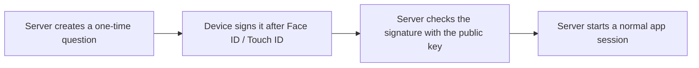
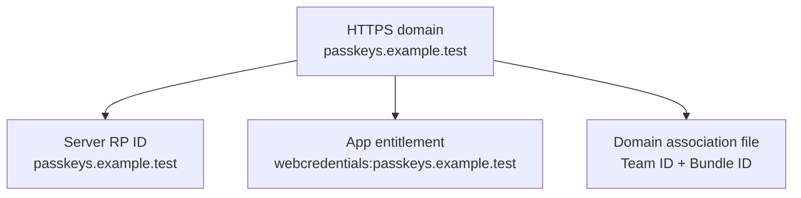
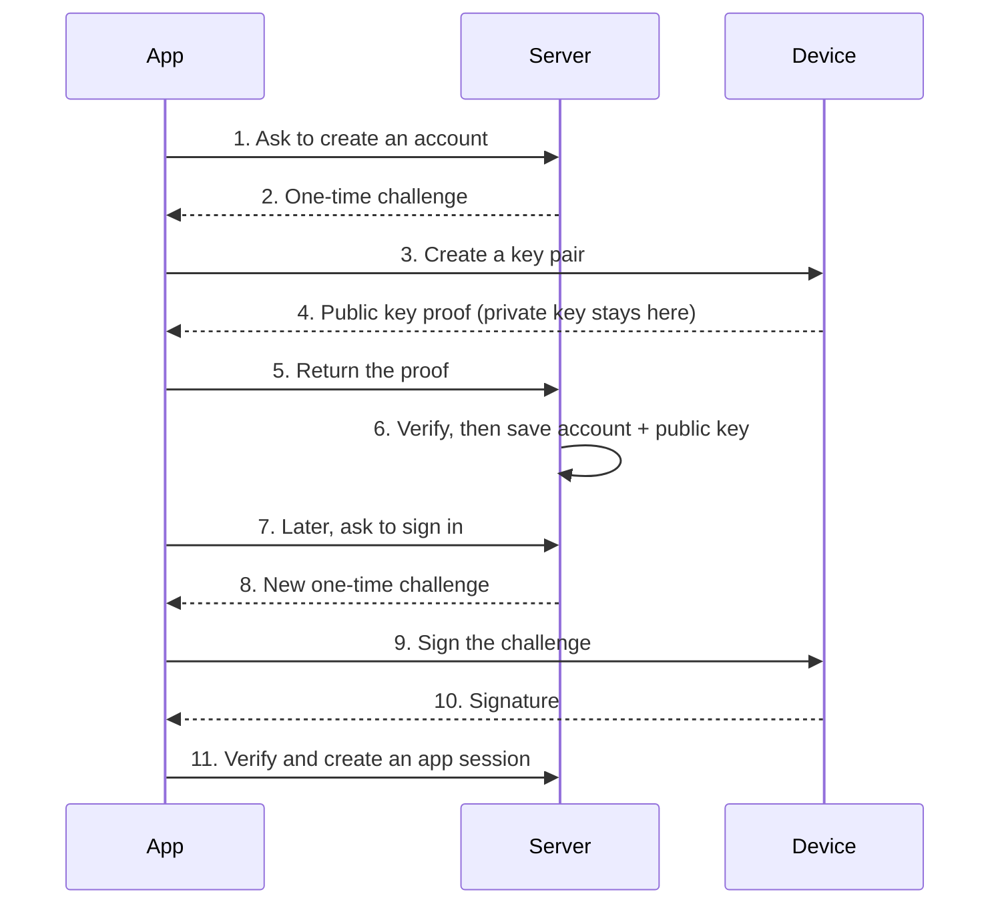

# First Success: Understand and Run the Lab

This page is the shortest path from “I have heard of Passkeys” to a working,
inspectable server. You do not need prior WebAuthn or cryptography knowledge.

## The whole idea in one minute

A password asks the server to recognize a secret that you type. A Passkey asks
your device to sign a one-time question from the server. The device keeps the
private key; the server keeps only the matching public key.



The word **ceremony** in this repository only means one complete registration
or sign-in exchange. The word **RP** means your server or service.

## What works without an iPhone

The automated tests contain a small synthetic authenticator. It creates real
P-256 keys and signatures, so you can run the complete server-side protocol on
macOS without pretending that `curl` is a Passkey client.

```sh
swift --version
just test
```

Success is a zero exit code and a summary with no failed tests. Then start the
HTTP process:

```sh
just server
```

In a second terminal:

```sh
curl -i http://127.0.0.1:8080/healthz
```

Success is `HTTP/1.1 200 OK` and `{"status":"ok"}`. This proves that the
package, database, and HTTP boundary work. It does **not** perform a platform
Passkey ceremony.

## What needs a real device and domain

Apple's Passkey UI checks that the signed app and HTTPS domain belong together.
There are four values that must agree:



Replace the examples with a domain, Apple Team ID, and Bundle ID you control.
Follow [Run the complete system](07-run-end-to-end.md) for the exact commands.

## Registration versus sign-in



Notice the ordering: an account is saved only after registration proof passes,
and a challenge is accepted only once.

## Five terms you need first

| Plain-language meaning | Term used in code |
| --- | --- |
| Your service and its trusted domain | relying party (RP), RP ID |
| One-time random question from the server | challenge |
| Registration or sign-in exchange | ceremony |
| Public identifier for one device credential | credential ID |
| Login state used after the Passkey check | application session |

Use the [glossary](appendices/glossary.md) only when another unfamiliar term
appears. The [mental model](01-mental-model.md) is the next conceptual chapter.

## A practical learning loop

For each security check:

1. read its plain-language purpose;
2. find the corresponding `guard` in the verifier;
3. find the test whose name states the rejected attack;
4. temporarily change the input in that test and observe the failure;
5. restore the test before continuing.

Start with `rejectsWrongOriginAndConsumesChallenge` in
`Tests/PasskeyServerTests/CeremonyVerificationTests.swift`. It demonstrates both
domain binding and one-time challenge consumption without requiring protocol
byte knowledge.

## Honest boundary

This repository is useful as an executable reference and a single-node lab. It
is not a deploy-and-forget authentication product. Before production, you still
need a shared deployment topology, rate limiting, observability, recovery,
credential management, backups, migrations, and an incident process. The
[production checklist](09-production-hardening.md) turns those into explicit
acceptance criteria.
