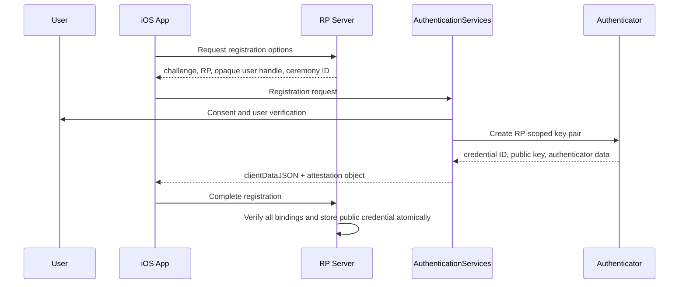
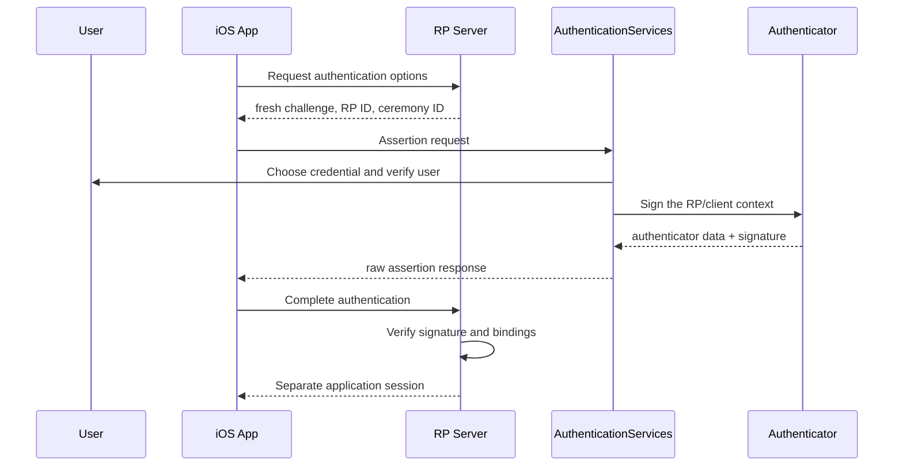

# The Passkey Mental Model

## 1. What authentication proves

The server ultimately decides which account may authorize a request. A password system asks the client and server to demonstrate knowledge of the same secret. A Passkey system asks an authenticator to prove possession of a private key by signing a fresh server challenge.

The server stores the public key. A leaked credential database does not contain the private key needed to create a valid signature.

## 2. The five actors

| Actor | This lab | Responsibility |
| --- | --- | --- |
| User | Person operating the iPhone | Consents to a ceremony and completes local verification |
| Authenticator | Platform authenticator / iCloud Keychain | Creates credential key pairs, protects private keys, and signs |
| Client platform | iOS / AuthenticationServices | Mediates RP requests and enforces credential scope and user consent |
| Client application | SwiftUI app | Relays server options to the OS and raw results back to the server |
| Relying party | Swift server | Generates challenges, verifies bindings/signatures, stores public credentials, and issues app sessions |

Biometric templates do not go to the app or server. Face ID, Touch ID, a device passcode, or another local method authorizes the authenticator to use the private key. The server observes the signed UV flag, not the biometric.

## 3. The two ceremonies

### Registration



The private key never leaves the authenticator.

### Authentication



A Passkey credential and an application session are different objects. WebAuthn proves control of a credential at login or step-up time. The application then uses a scoped, expiring, revocable session for ordinary API calls.

## 4. Where phishing resistance comes from

“The user does not type a secret” is only part of the answer. A credential is scoped to an RP ID. Client data includes the origin. Authenticator data includes the SHA-256 hash of the RP ID. The server validates both against values it already trusts.

Skipping a binding creates a concrete attack:

| Check | What it binds | Failure if omitted |
| --- | --- | --- |
| challenge | response to one fresh request | replay of a previously valid response |
| ceremony type | response to create vs get | cross-ceremony context confusion |
| origin | client context to an allowed HTTPS origin | use of a response initiated by an unexpected origin |
| RP ID hash | authenticator output to credential scope | acceptance of authenticator data for the wrong RP |
| signature | authenticator and client bytes to the private key | tampering and lack of possession proof |
| UP / UV | user interaction and local verification policy | silent or insufficiently verified key use |

The app does not get to declare any check successful. It is a relay across trust boundaries. The RP repeats the verification from raw bytes and server-held expectations.

## 5. Never merge these identifiers

| Value | Created by | Purpose | Secret? |
| --- | --- | --- | --- |
| account ID | RP | application database primary key | No |
| user handle (`user.id`) | RP | stable opaque RP-local account ID stored with the credential | No, but avoid personal data |
| credential ID | authenticator | selects a credential source/public key | No |
| challenge | RP | makes a ceremony fresh and single-use | Must be unpredictable |
| ceremony ID | RP | finds server-side expectations | Treat as unguessable but not sufficient authentication |
| session token | RP | authorizes subsequent application requests | Yes: bearer secret |

Do not use an email address as a user handle. A random handle stays stable when a username changes and has no meaning outside the RP.

## 6. Synced Passkeys and counters

Passkeys may be securely synced across a user's devices. The authenticator flags expose backup eligibility (BE) and current backup state (BS). BS may only be set when BE is set, and BE must not change for a credential.

Traditional single-device authenticators often increment `signCount`. Synced implementations may leave it at zero. Therefore:

- `0 -> 0` means the counter is unsupported and is not itself a failure;
- a nonzero counter should advance;
- a non-advancing nonzero counter is a clone/race risk signal;
- counter analysis must be combined with backup state, session telemetry, notifications, and recovery policy.

The lab uses a fail-closed policy for nonzero counter rollback while allowing the common `0 -> 0` synced-Passkey case.

## 7. The signed message

Authentication verification centers on this exact byte sequence:

```text
authenticatorData || SHA-256(clientDataJSON)
```

`clientDataJSON` binds challenge, type, and origin to the client context. Authenticator data binds RP ID, flags, counter, and extensions to the authenticator context. The signature makes the combined proof tamper-evident and proves possession of the credential private key.

Never decode and re-encode `clientDataJSON` before hashing it. The signature covers the original bytes, not a semantically equivalent JSON document.

## Completion check

Without looking at code, explain:

1. why the server stores a public key but the app never receives the private key;
2. why both origin and RP ID hash are checked;
3. why a session token is not a Passkey;
4. why a zero signature counter is not automatically an attack;
5. which exact bytes an ES256 assertion signs.
