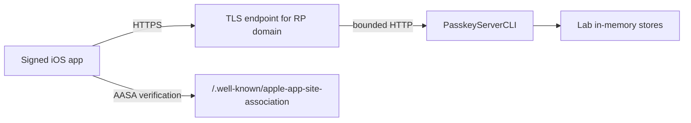

# Hands-on 5: Run the Complete System

## What can run locally

The RP package, HTTP server, AASA route, and synthetic-authenticator tests run entirely on macOS:

```sh
nix develop
just test
just server
```

In another terminal:

```sh
curl -i http://127.0.0.1:8080/healthz
curl -i http://127.0.0.1:8080/.well-known/apple-app-site-association
curl -i \
  -H 'content-type: application/json' \
  --data '{"username":"alice@example.com","displayName":"Alice"}' \
  http://127.0.0.1:8080/v1/passkeys/registration/options
```

This verifies server transport, not an Apple Passkey ceremony. AuthenticationServices requires a domain association and HTTPS context.

## Real-device topology



For a real test, expose the local listener through a TLS reverse proxy or deploy the executable behind HTTPS. The externally visible host must match RP ID/origin/entitlement configuration. Do not forward arbitrary `Host` or origin values into security policy.

## Step 1: Choose identifiers

Example placeholders:

```text
RP ID:         passkeys.example.com
Origin:        https://passkeys.example.com
Bundle ID:     com.example.PasskeyLab
Team ID:       ABCDE12345
Application ID ABCDE12345.com.example.PasskeyLab
```

Use a domain and identifiers you control. Do not use `example.com` literally for a real ceremony.

## Step 2: Start the server

```sh
export PASSKEY_RP_ID=passkeys.your-domain.test
export PASSKEY_ALLOWED_ORIGINS=https://passkeys.your-domain.test
export PASSKEY_APP_ID=ABCDE12345.com.yourcompany.PasskeyLab
export PASSKEY_HOST=127.0.0.1
export PASSKEY_PORT=8080
just server
```

The server intentionally prints an in-memory-storage warning. Registration and sessions disappear on restart.

## Step 3: Put HTTPS in front

Your TLS layer must:

- present a certificate valid for the RP host;
- forward only to the local server;
- preserve response bodies and the AASA path without redirects;
- apply request/header/body timeouts;
- define which forwarding headers are trusted;
- avoid rewriting AASA to an HTML error/login page.

Verify externally:

```sh
curl -i https://passkeys.your-domain.test/healthz
curl -i https://passkeys.your-domain.test/.well-known/apple-app-site-association
```

The AASA request must return 200 over HTTPS with no redirect and the exact signed application ID.

## Step 4: Configure and sign the app

Update:

- `Apps/PasskeyLab/PasskeyLab/AppConfiguration.swift`;
- `Apps/PasskeyLab/PasskeyLab/PasskeyLab.entitlements`;
- target Bundle ID and signing team in Xcode.

Build the app on a device. The `?mode=developer` entitlement requires a development-signed app and the corresponding device development settings. Remove the mode for production.

## Step 5: Observe registration

1. Enter a username and display name.
2. Tap **Create account with a Passkey**.
3. Complete the system sheet.
4. Observe a 201 response from registration completion.
5. Attempt the same username again and observe a coarse username-unavailable response.

Server-side expected result:

- one account;
- one credential with public key, user handle, flags, counter, and timestamps;
- no private key, biometric, or reusable registration challenge.

## Step 6: Observe authentication

1. Tap **Sign in with a Passkey**.
2. Choose the registered account in system UI.
3. Complete user verification.
4. Observe successful assertion verification and session issuance.
5. Use the signed-in UI, then sign out.

Expected result:

- credential last-used metadata updates;
- only a hashed session record is stored;
- logout deletes it;
- the Passkey remains available for a future login.

## Step 7: Restart and understand the failure

Restart the lab server. Credentials and sessions are gone because the teaching adapters are in memory. The Passkey may still exist on the device, but the RP no longer has its public key and cannot verify it.

This is the exact reason persistence is part of authentication correctness, not an optional deployment detail.

## Troubleshooting matrix

| Symptom | Inspect |
| --- | --- |
| AuthenticationServices rejects request immediately | entitlement domain, AASA application ID, signing team, device Developer Mode |
| AASA works in curl but not on device | redirect/CDN cache, alternate-mode requirements, reinstall timing, certificate chain |
| registration says invalid ceremony | challenge TTL, duplicate completion, server restart, proxy retry |
| registration says invalid registration | internal request-ID-correlated logs for origin/RP/flags/CBOR policy |
| authentication is unauthorized | credential ID, user handle, origin/RP, UV, signature, counter |
| Xcode cannot build | full Xcode selected, signing team, local Swift package resolution |
| server works but app cannot connect | public HTTPS route, ATS, DNS, certificate validity, device network |

## Completion criteria

- Server unit/integration tests pass.
- Live `/healthz`, AASA, and options routes are verified through the public HTTPS endpoint.
- A signed real-device app registers and authenticates.
- Logout revokes only the application session.
- Server restart behavior is understood and recorded as a lab limitation.
