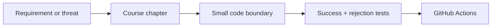
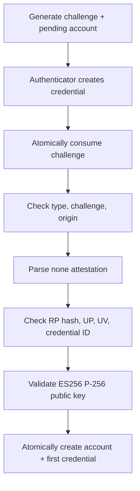
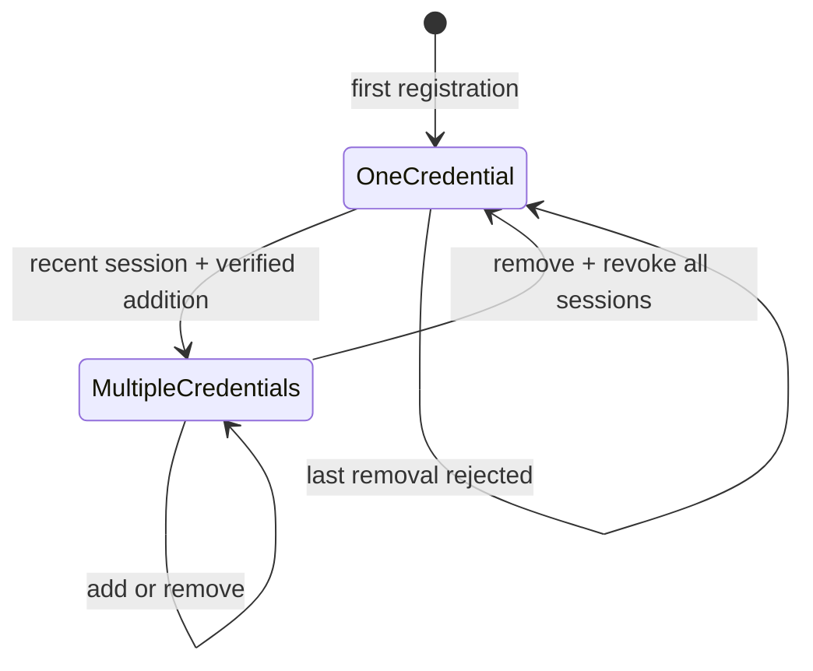

# Coverage and Traceability Audit

This page answers a precise question: for the functionality this repository
claims to implement, where is the explanation, implementation, and executable
evidence?

“Covered” here does not mean “ready for every production deployment.” It means
the lab's declared single-node, ES256, `attestation: none` scope has a documented
policy, an implementation boundary, and tests for its important success and
failure paths. The final section lists capabilities intentionally not present.

## How to read the maps

If any arrow is missing, the feature is not fully traceable. File names below
are stable navigation targets; exact line numbers are intentionally omitted
because the course is edited frequently.

## Protocol primitives

| Requirement | Explanation | Implementation | Executable evidence |
| --- | --- | --- | --- |
| Unpadded, canonical Base64url | `03-wire-format.md` §1 | `Base64URL.swift` | `Base64URLTests` RFC vectors, alphabet, padding/alphabet/length rejection |
| Bounds-checked integer/byte reads | `03-wire-format.md` §2 | `ByteCursor.swift` | `ByteCursorTests` truncation and endian cases |
| Deterministic, bounded CBOR subset | `03-wire-format.md` §3 | `CBOR.swift` | `CBORTests` canonical integers/maps, duplicate keys, indefinite values, depth/string limits |
| Authenticator-data structure and flags | `03-wire-format.md` §4 | `AuthenticatorData.swift` | `AuthenticatorDataTests` registration parse, reserved flags, invalid BS/BE |
| ES256/P-256 COSE key policy | `03-wire-format.md` §5 | `COSEKey.swift` | `AuthenticatorDataTests`, verifier invalid-point test |
| Exact client-data validation | `01-mental-model.md` §7, `03-wire-format.md` | `CollectedClientData.swift` | `CollectedClientDataTests` type, challenge, origin, cross-origin, padding and size behavior |

## Registration ceremony

| Invariant | Implementation | Rejection evidence |
| --- | --- | --- |
| Username/display name are nonempty and bounded | `PasskeyService.beginRegistration` | `CeremonyAndOptionsTests` configuration/input boundaries |
| Existing username cannot create another first account | repository uniqueness + service pre-check | in-memory and SQLite duplicate/rollback tests |
| Account remains pending until proof succeeds | `PendingRegistration`, `CeremonyState` | registration-options test and rejection tests |
| Challenge is random, expiring, purpose-bound, single-use | ceremony stores | actor consume/expiry test and two-SQLite-connection race |
| `webauthn.create`, challenge and origin match | `ClientDataValidator` | parameterized wrong-type/origin/challenge tests |
| Credential ID length is 1...1,024 bytes | `RegistrationVerifier` | verifier boundary tests |
| Only `fmt: none` and empty `attStmt` are accepted | `RegistrationVerifier` | parameterized format/statement rejection tests |
| RP ID hash, UP and required UV match policy | `RegistrationVerifier` | wrong-RP, missing-UP and missing-UV tests |
| top-level and embedded credential IDs match | `RegistrationVerifier` | parameterized credential-substitution test |
| COSE key is ES256/P-256 and a valid curve point | `COSEEC2PublicKey`, `WebAuthnCrypto` | parser policy tests and invalid-point test |
| Account plus first credential commits atomically | repository `create` | inconsistent binding and SQLite rollback/reopen tests |

## Authentication ceremony

| Invariant | Implementation | Rejection evidence |
| --- | --- | --- |
| Discoverable and username-hinted flows do not trust client account claims | `PasskeyService.beginAuthentication` | empty allow-list/account-lookup test |
| Completion consumes the correct one-time ceremony | `PasskeyService.completeAuthentication` | ceremony type/single-use tests |
| credential ID selects stored public state | repository lookup + constant-time comparison | credential mismatch/unknown mapping tests |
| `webauthn.get`, challenge and origin match | `ClientDataValidator` | parameterized wrong-type/origin and replay tests |
| RP hash, UP and UV match | `AuthenticationVerifier` | parameterized wrong-RP/missing-UP/missing-UV tests |
| discoverable user handle is present and account-bound | `AuthenticationVerifier` | missing and mismatched handle tests |
| backup eligibility cannot change | `AuthenticationVerifier` | changed-BE test |
| exact raw bytes are signed with stored ES256 key | `WebAuthnCrypto.verifyES256` | alternate-key and malformed-signature tests |
| nonzero signature counter advances | `AuthenticationVerifier` | repeated-counter test; zero-counter policy tests |
| accepted metadata is durable | repository update | in-memory end-to-end and SQLite reopen tests |

## Sessions, HTTP, persistence, and client

| Boundary | Implemented behavior | Evidence |
| --- | --- | --- |
| Session token | 256-bit random bearer; only SHA-256 hash stored; fixed expiry; one/all-token revocation port | `SessionTests`, SQLite session reopen/revoke test |
| HTTP input | 64 KiB body cap, JSON content type, typed decoding, route allow-list | named HTTP boundary cases and oversized-body test |
| HTTP output | coarse public errors, no-store/nosniff/request-ID headers | `PasskeyAPITests` security-header and error tests |
| Protected routes | exact bearer extraction, session authentication, logout | current-user/logout tests |
| AASA | exact application ID JSON without application redirect logic | AASA route test and real-device guide |
| SQLite | foreign keys, WAL, transactions, uniqueness, durable ceremony/session/account records | `SQLitePersistenceTests` |
| Swift client | exact HTTPS origin, typed JSON, raw WebAuthn byte relay, bearer placement | `PasskeyAPIClientTests` |
| Apple authorization bridge | platform request construction, modal/AutoFill presentation, delegate continuation ownership | `06-ios-client.md`; requires device integration for OS behavior |

## CI release evidence

`.github/workflows/ci.yml` runs on every push to `main` and every pull request:

1. strict formatting and documentation-comment validation;
2. release build of every package target;
3. the complete test suite.

The real-device/AASA/HTTPS ceremony cannot run on a generic GitHub-hosted runner.
`07-run-end-to-end.md` therefore defines it as a separate staging acceptance
test instead of implying that unit tests cover Apple signing and domain trust.

## Explicitly incomplete capabilities

The following are documented requirements for a real product, not hidden or
partially implemented features:

| Capability not implemented | Why it is outside the current lab | Required next boundary |
| --- | --- | --- |
| User-defined Passkey labels and rename | Addition, inventory, safe removal, recent-auth enforcement, and session revocation are implemented | label validation, persistence migration, rename API and audit events |
| Account recovery | Product-specific identity and risk decision | recovery policy, cooling-off, notifications, incident tests |
| Multi-node database/cache topology | SQLite adapter is single-node | shared transactional store and multi-instance tests |
| Distributed rate limiting | Requires deployment-wide identity/network policy | shared limiter with explicit outage behavior |
| Production TLS/proxy handling | Listener is intentionally local HTTP | controlled ingress, trusted-hop and timeout policy |
| Browser cookie/CSRF/refresh sessions | Lab client uses a simple bearer | client-specific session architecture |
| Attestation trust formats | Lab intentionally requests and accepts only `none` | format validators, trust roots, metadata and revocation |
| Audit/metrics/alert pipeline | `print` is not an operational telemetry system | structured redacted events and alert rules |
| Schema migration/backup automation | Tables are bootstrapped for teaching | versioned migrations and restore drills |
| Parser fuzzing and external conformance corpus | Deterministic tests exist, fuzz infrastructure does not | continuous fuzz target and reviewed W3C vectors |
| Automated signed-device ceremony | Hosted CI has no signed app/device/RP domain | staging device farm or documented manual release gate |

Calling any row above “implemented” without adding its explanation,
implementation, negative tests, and operational acceptance evidence would make
the repository less honest, not more complete.

## Audit conclusion

Within the declared lab scope, the protocol, ceremony, persistence, HTTP,
session, and client-relay layers are traceable from explanation to executable
tests. The repository is comprehensive as an implementation-first reference for
that scope. It is deliberately not a comprehensive authentication product; the
table above is the authoritative gap list, and `09-production-hardening.md`
defines the acceptance gate before expanding that claim.

## Credential lifecycle coverage

The addition ceremony is account-bound in server state, current IDs are sent as
exclusions, SQLite changes are transactional, foreign IDs are rejected, and a
successful removal revokes every application session. Server, persistence,
HTTP, and typed-client tests cover these boundaries.
