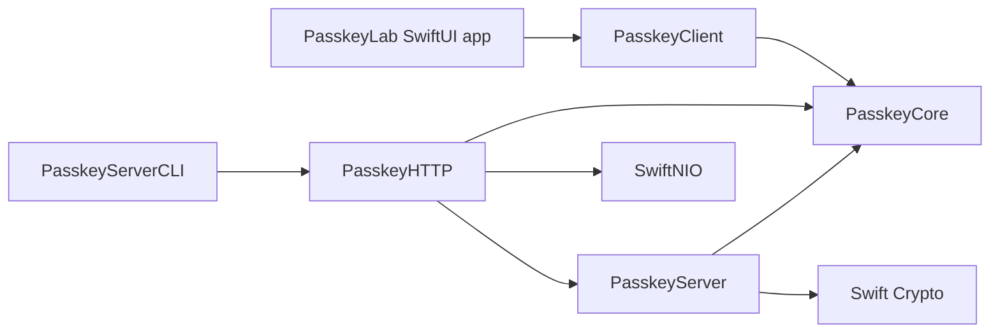
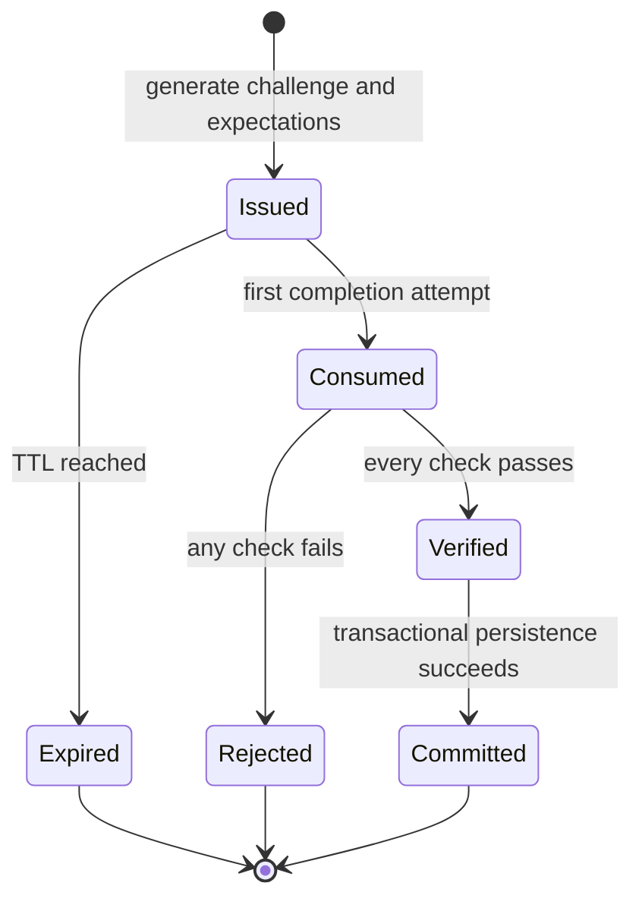

# Architecture and Design Decisions

## Design objective

The code should make security reasoning visible. A learner must be able to point from a protocol requirement to a small implementation boundary and a test. Transport, persistence, cryptography, and UI must not collapse into one handler.

## Dependency direction

`PasskeyCore` has no dependency on UI, HTTP, storage, NIO, or a WebAuthn library. `PasskeyServer` has no dependency on HTTP. `PasskeyClient` does not verify an assertion; it drives the OS API and relays raw bytes. These constraints keep trust decisions in the RP domain.

## Ports and adapters

| Port | Teaching adapter | Production adapter responsibility |
| --- | --- | --- |
| `CeremonyStore` | actor-backed dictionary | atomic read-delete, TTL, multi-instance consistency, capacity controls |
| `PasskeyRepository` | actor-backed dictionaries | transactions, uniqueness, indexes, encryption policy, migrations, backups |
| `SessionStore` | actor-backed hash map | hashed token lookup, expiry index, revocation, incident-wide invalidation |
| `PasskeyAPIClient.Transport` | `URLSession` or test closure | networking policy, metrics, optional pinning, retry classification |
| `PasskeyHTTPServer` | SwiftNIO HTTP/1.1 | TLS/proxy integration, deadlines, distributed limits, graceful shutdown |

## Ceremony state machine

There is no transition from Rejected back to Issued. A failed completion consumes the challenge. The client starts a new ceremony. This makes repeated guesses and ambiguous retry behavior harder to exploit.

## Registration transaction

The account stays inside `PendingRegistration` until the attestation response is verified. `PasskeyRepository.create(user:credential:)` writes the account and its first credential atomically.

This avoids two dangerous designs:

1. creating an account before its first authentication method is valid;
2. treating an unauthenticated “register” endpoint as permission to add a credential to an existing account.

Adding another Passkey is a separate future use case and must require an authenticated session plus recent step-up.

## Narrow cryptographic policy

The lab supports one credential algorithm:

- COSE key type: EC2 (`2`);
- algorithm: ES256 (`-7`);
- curve: P-256 (`1`);
- x and y coordinates: exactly 32 bytes;
- assertion signature: ASN.1 DER ECDSA as returned by WebAuthn;
- attestation format: `none` with an empty statement.

A small algorithm surface prevents downgrade, ambiguous key interpretation, and a false impression that every attestation format is interchangeable. A production service may add algorithms, but every addition needs complete parsing, verification, policy, fixtures, and monitoring.

## Error boundary

Core and server errors are intentionally precise for tests and internal audit events. `PasskeyAPI` maps them to coarse public errors:

- malformed request;
- invalid/expired ceremony;
- invalid registration;
- unauthorized;
- internal error.

An unauthenticated caller should not receive enough detail to enumerate accounts, distinguish registered credentials, or adapt cryptographic probes. Every response includes a request ID so a user-visible failure can be correlated with internal telemetry.

## Session boundary

The Passkey private key remains in the authenticator. After an assertion succeeds, `SessionManager` creates a separate 256-bit bearer and stores only `SHA-256(token)`.

Hashing is not a replacement for a secure database and a random token. It reduces the direct usefulness of a read-only session-store disclosure. Application session expiry, scope, refresh, CSRF policy, and device binding are independent product decisions.

## Invariants worth preserving

1. Only server-generated, server-stored values are expectations.
2. Every challenge is unpredictable, expiring, purpose-bound, and consumed once.
3. Raw signed bytes are never reconstructed from decoded values.
4. RP ID and origin are validated independently.
5. Credential ID, public key, account ID, and user handle stay distinct.
6. Registration persistence is atomic.
7. Existing-account credential addition is authenticated and step-up protected.
8. Public API errors reveal less than internal verification errors.
9. Credential authentication and application session management remain separate.
10. Production limitations are documented rather than hidden behind “sample code.”
